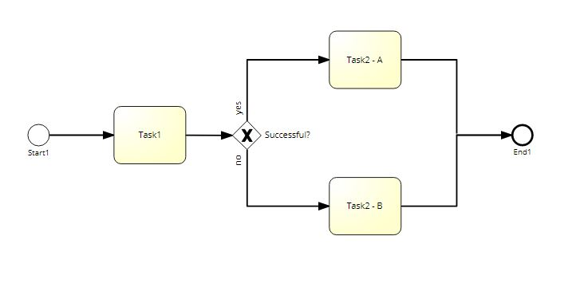
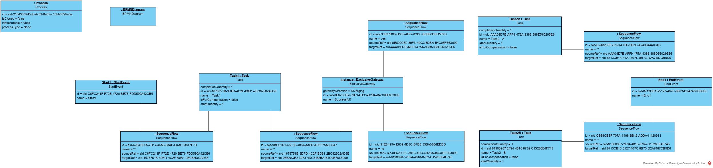

## BPMN2UML

Der BPMN Standard basiert auf den Prinzipien der Meta Object Facility (MOF) und definiert daher die Semantik der Modelliersprache als Metamodell mittels UML Klassen. Das bedeutet, dass jedes Prozessmodell sich auf eine Klassenhierachie zurückführen lassen muss.

### Inhalt und Zielsetzung

Ziel des Projektes ist es, den BPMN Standard zu analysieren und daraus ein möglichst vollständiges UML Diagramm (Klassen Diagramm) zu erstellen. Das UML Diagramm basiert auf dem [BPMN Standard 2.0.2](https://www.omg.org/spec/BPMN/2.0.2/)

### Vorraussetzungen

Benötigtes Softwaretool:

* [Visual Paradigm](https://www.visual-paradigm.com/download/community.jsp)

Kenntnisse:
* [UML Klassen Diagramme](https://developer.ibm.com/articles/an-introduction-to-uml/)
* BPMN

### Setup

* Download des Repositories
* Öffnen des .\BPMN2UML\VisualParadigm_Project\BPMN2UML_V2.vpp Files mit Visual Paradigm
* Im Diagram Navigator -> UML Diagrams > Class Diagram > BPMN2UML auswählen

#### Override Connector Limit

By default, the Visual Paradigm formatting tool has a connector limit of 300, which means that you cannot automatically format diagrams with more than 300 relationships. To avoid this limit, you can set an environment variable that increases the limit.

[Guide - Connector Limit](https://knowhow.visual-paradigm.com/diagramming/max-number-connector-layout/)

### BPMN Standard als UML Klassendiagramm


#### Conformance Klassen

Die Conformance Klassen von BPMN sind durch verschiedene Farbhintergründen der Klassen und Attribute markiert.

**Die Conformance Klassen von BPMN:**

* Descriptive Conformance Sub-Class (türkis)
* Analytic Conformance Sub-Class (grün)
* Common Executable Conformance Sub-Class (orange)
* Process Modelling Conformance Class (weiß)
* Für die Prozessausführung (gelb)

### Proof of concept - BPMN Diagramm als Objektdiagramm

Als "proof of concept" wurde mit dem erstellten Klassendiagramm ein Objektdiagramm erstellt, welches ein beispielhaftes BPMN Modell darstellt.

#### Beispielhaftes BPMN Modell

Follgendes BPMN Modell wurde für das "proof of concept" verwendet.


#### BPMN Modell als XML (vereinfacht)

Das modellierte BPMN Modell sieht als XML in vereinfachter Form so aus:

<details>

````xml
<?xml>
   <process id="sid-21543069-f5db-4c09-8a35-c13bb8558a3e" isClosed="false" isExecutable="false" processType="None">
      <startEvent id="sid-C6FC241F-F72E-4720-BE76-FDD590A42CB6" name="Start1">
         <outgoing>sid-62B4BF65-7D17-4656-88AF-D0AC23817F7D</outgoing>
      </startEvent>
      <task completionQuantity="1" id="sid-1678751B-3DFD-4C2F-B0B1-2BC82502AD5E" isForCompensation="false" name="Task1" startQuantity="1">
         <incoming>sid-62B4BF65-7D17-4656-88AF-D0AC23817F7D</incoming>
         <outgoing>sid-9BEB1D13-5E3F-485A-A8D7-4FB975A6C647</outgoing>
      </task>
      <endEvent id="sid-8713CB15-5127-407C-8B73-D2A7487CB9D6" name="End1">
         <incoming>sid-D2A826FE-6253-47FD-9B2C-A243044A034C</incoming>
         <incoming>sid-CB58CE8F-707A-4498-BB42-ADDA41420911</incoming>
      </endEvent>
      <exclusiveGateway gatewayDirection="Diverging" id="sid-0E620CE2-39F3-4DC3-B2BA-B4C0EF663099" name="Successful?">
         <incoming>sid-9BEB1D13-5E3F-485A-A8D7-4FB975A6C647</incoming>
         <outgoing>sid-91E8499A-E839-4D5C-B7B8-53BA0886EDED</outgoing>
         <outgoing>sid-7CB37B08-D365-4F97-82DC-B6BB0DBD5F2D</outgoing>
      </exclusiveGateway>
      <task completionQuantity="1" id="sid-AAA09D7E-AFF9-475A-9388-388D560295E6" isForCompensation="false" name="Task2 - A" startQuantity="1">
         <incoming>sid-7CB37B08-D365-4F97-82DC-B6BB0DBD5F2D</incoming>
         <outgoing>sid-D2A826FE-6253-47FD-9B2C-A243044A034C</outgoing>
      </task>
      <task completionQuantity="1" id="sid-81900967-2F94-4816-8762-C15280E4F745" isForCompensation="false" name="Task2 - B" startQuantity="1">
         <incoming>sid-91E8499A-E839-4D5C-B7B8-53BA0886EDED</incoming>
         <outgoing>sid-CB58CE8F-707A-4498-BB42-ADDA41420911</outgoing>
      </task>
      <sequenceFlow id="sid-62B4BF65-7D17-4656-88AF-D0AC23817F7D" name="" sourceRef="sid-C6FC241F-F72E-4720-BE76-FDD590A42CB6" targetRef="sid-1678751B-3DFD-4C2F-B0B1-2BC82502AD5E">
      </sequenceFlow>
      <sequenceFlow id="sid-9BEB1D13-5E3F-485A-A8D7-4FB975A6C647" name="" sourceRef="sid-1678751B-3DFD-4C2F-B0B1-2BC82502AD5E" targetRef="sid-0E620CE2-39F3-4DC3-B2BA-B4C0EF663099">
      </sequenceFlow>
      <sequenceFlow id="sid-91E8499A-E839-4D5C-B7B8-53BA0886EDED" name="no" sourceRef="sid-0E620CE2-39F3-4DC3-B2BA-B4C0EF663099" targetRef="sid-81900967-2F94-4816-8762-C15280E4F745">
      </sequenceFlow>
      <sequenceFlow id="sid-7CB37B08-D365-4F97-82DC-B6BB0DBD5F2D" name="yes" sourceRef="sid-0E620CE2-39F3-4DC3-B2BA-B4C0EF663099" targetRef="sid-AAA09D7E-AFF9-475A-9388-388D560295E6">
      </sequenceFlow>
      <sequenceFlow id="sid-D2A826FE-6253-47FD-9B2C-A243044A034C" name="" sourceRef="sid-AAA09D7E-AFF9-475A-9388-388D560295E6" targetRef="sid-8713CB15-5127-407C-8B73-D2A7487CB9D6">
      </sequenceFlow>
      <sequenceFlow id="sid-CB58CE8F-707A-4498-BB42-ADDA41420911" name="" sourceRef="sid-81900967-2F94-4816-8762-C15280E4F745" targetRef="sid-8713CB15-5127-407C-8B73-D2A7487CB9D6">
      </sequenceFlow>
   </process>
   <bpmndi:BPMNDiagram id="sid-140bc4a4-1889-4f59-b8c1-2043e114ba49">
      <!-- Diagram and rendering information -->
   </bpmndi:BPMNDiagram>
</definitions>

````


</details>

#### Objektdiagramm des BPMN Modells
Aus dem oben angeführten XML Code lässt sich folgendes UML Objektdiagramm ableiten:


